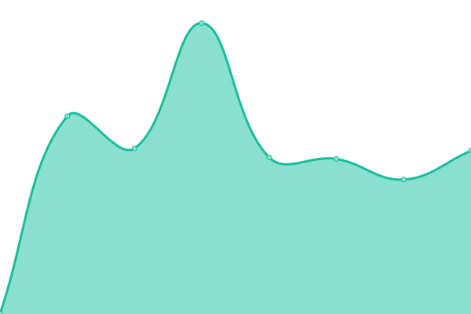
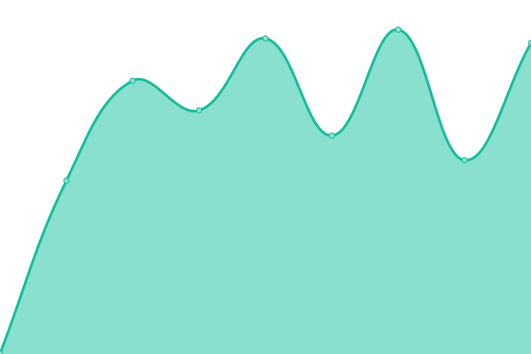
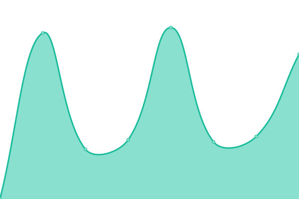

# [📈 Live Status](https://status.gnosischain.com): <!--live status--> **🟧 Partial outage**

This repository contains the open-source uptime monitor and status page for [Gnosis Chain](https://www.gnosischain.com/), powered by [Upptime](https://github.com/upptime/upptime).

With [Upptime](https://upptime.js.org), you can get your own unlimited and free uptime monitor and status page, powered entirely by a GitHub repository. We use [Issues](https://github.com/gnosischain/gnosischain-uptime/issues) as incident reports, [Actions](https://github.com/gnosischain/gnosischain-uptime/actions) as uptime monitors, and [Pages](https://status.gnosischain.com) for the status page.

<!--start: status pages-->
<!-- This summary is generated by Upptime (https://github.com/upptime/upptime) -->
<!-- Do not edit this manually, your changes will be overwritten -->
<!-- prettier-ignore -->
| URL | Status | History | Response Time | Uptime |
| --- | ------ | ------- | ------------- | ------ |
|  [RPC](https://rpc.gnosischain.com/) | 🟩 Up | [rpc.yml](https://github.com/gnosischain/gnosischain-uptime/commits/HEAD/history/rpc.yml) | 

 456ms
     
 | 

<a href="https://status.gnosischain.com/history/rpc">99.87%</a>
    

|  [GatewayFM Public RPC](https://rpc.gnosis.gateway.fm/) | 🟩 Up | [gateway-fm-public-rpc.yml](https://github.com/gnosischain/gnosischain-uptime/commits/HEAD/history/gateway-fm-public-rpc.yml) | 

 482ms
     
 | 

<a href="https://status.gnosischain.com/history/gateway-fm-public-rpc">100.00%</a>
    

|  [Beacon RPC](https://rpc-gbc.gnosischain.com/eth/v1/beacon/headers) | 🟩 Up | [beacon-rpc.yml](https://github.com/gnosischain/gnosischain-uptime/commits/HEAD/history/beacon-rpc.yml) | 

 1039ms
     
 | 

<a href="https://status.gnosischain.com/history/beacon-rpc">100.00%</a>
    

|  [Gnosisscan](https://gnosisscan.io/) | 🟩 Up | [gnosisscan.yml](https://github.com/gnosischain/gnosischain-uptime/commits/HEAD/history/gnosisscan.yml) | 

 422ms
     
 | 

<a href="https://status.gnosischain.com/history/gnosisscan">100.00%</a>
    

|  [Blockscout Explorer](https://blockscout.com/xdai/mainnet) | 🟩 Up | [blockscout-explorer.yml](https://github.com/gnosischain/gnosischain-uptime/commits/HEAD/history/blockscout-explorer.yml) | 

 1349ms
     
 | 

<a href="https://status.gnosischain.com/history/blockscout-explorer">100.00%</a>
    

|  [Beacon Explorer](https://beacon.gnosischain.com/) | 🟥 Down | [beacon-explorer.yml](https://github.com/gnosischain/gnosischain-uptime/commits/HEAD/history/beacon-explorer.yml) | 

 511ms
     
 | 

<a href="https://status.gnosischain.com/history/beacon-explorer">0.00%</a>
    

|  [Ethstats](https://ethstats.gnosischain.com/) | 🟩 Up | [ethstats.yml](https://github.com/gnosischain/gnosischain-uptime/commits/HEAD/history/ethstats.yml) | 

 558ms
     
 | 

<a href="https://status.gnosischain.com/history/ethstats">100.00%</a>
    

|  [Faucet](https://gnosisfaucet.com/) | 🟩 Up | [faucet.yml](https://github.com/gnosischain/gnosischain-uptime/commits/HEAD/history/faucet.yml) | 

 1565ms
     
 | 

<a href="https://status.gnosischain.com/history/faucet">99.93%</a>
    

|  [Bridge Explorer](https://bridge-explorer.gnosischain.com/) | 🟥 Down | [bridge-explorer.yml](https://github.com/gnosischain/gnosischain-uptime/commits/HEAD/history/bridge-explorer.yml) | 

 969ms
     
 | 

<a href="https://status.gnosischain.com/history/bridge-explorer">99.99%</a>
    

|  [xDaiBridge](https://bridge.gnosischain.com/) | 🟥 Down | [x-dai-bridge.yml](https://github.com/gnosischain/gnosischain-uptime/commits/HEAD/history/x-dai-bridge.yml) | 

 126ms
     
 | 

<a href="https://status.gnosischain.com/history/x-dai-bridge">99.99%</a>
    

|  [OmniBridge](https://omni.gnosischain.com/bridge) | 🟥 Down | [omni-bridge.yml](https://github.com/gnosischain/gnosischain-uptime/commits/HEAD/history/omni-bridge.yml) | 

 979ms
     
 | 

<a href="https://status.gnosischain.com/history/omni-bridge">99.99%</a>
    

|  [Beacon Checkpoint Sync](https://checkpoint.gnosischain.com/) | 🟩 Up | [beacon-checkpoint-sync.yml](https://github.com/gnosischain/gnosischain-uptime/commits/HEAD/history/beacon-checkpoint-sync.yml) | 

 399ms
     
 | 

<a href="https://status.gnosischain.com/history/beacon-checkpoint-sync">100.00%</a>
    

<!--end: status pages-->

[**Visit our status website →**](https://status.gnosischain.com)

## 📄 License

- Powered by: [Upptime](https://github.com/upptime/upptime)
- Code: [MIT](./LICENSE) © [Gnosis Chain](https://www.gnosischain.com/)
- Data in the `./history` directory: [Open Database License](https://opendatacommons.org/licenses/odbl/1-0/)
